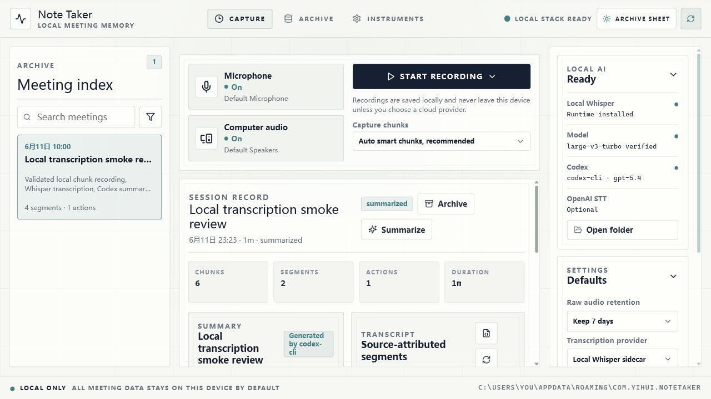
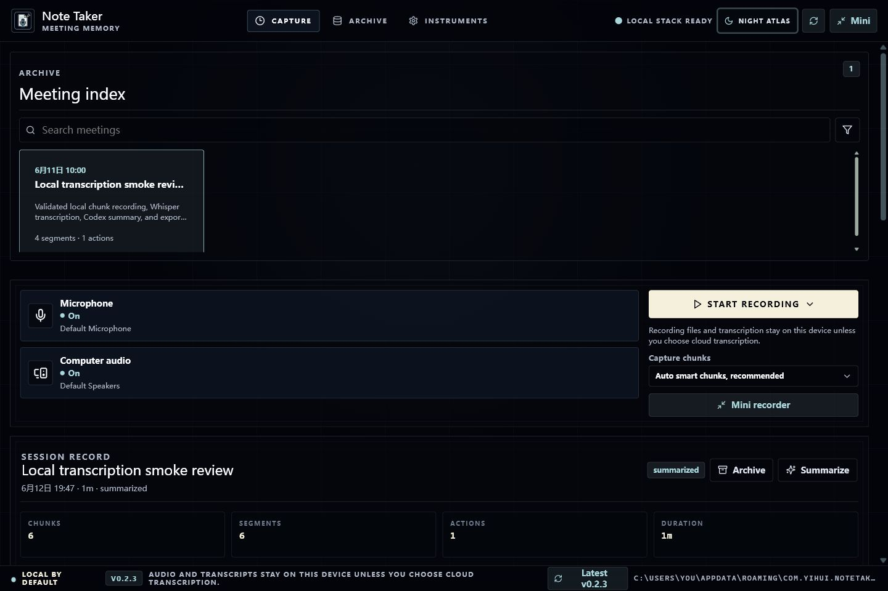
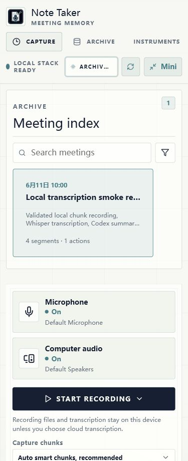

# Note Taker

Windows-first, local-first meeting capture and transcription app.

Note Taker records microphone and computer audio on Windows, stores meeting records in a local SQLite database, transcribes with a local Whisper-compatible sidecar by default, summarizes with Codex CLI, and exports Markdown or JSON notes.

## Demo

Archive Sheet theme:



Night Atlas theme:



Mobile layout:



## Current Status

Phase 1 is a working local-first MVP.

Implemented:

- Tauri 2 desktop app with React and TypeScript UI.
- Hoshikuzu-inspired Night Atlas and Archive Sheet themes.
- Microphone and system audio capture on Windows.
- Chunked recording with concurrent microphone and computer-audio streams.
- Smart transcription windows built from short persisted capture chunks.
- SQLite storage for meetings, audio chunks, transcript segments, summaries, settings, and search.
- Local Whisper-compatible sidecar transcription.
- Optional OpenAI Speech-to-Text provider when `OPENAI_API_KEY` is available.
- Codex CLI structured summaries from transcript segments.
- Local search over title, summary, action items, topics, and transcript text.
- Markdown and JSON export to the app-data `exports/` directory.
- Guided local sidecar setup for whisper.cpp runtime and model downloads.
- Meeting soft archive: archived meetings are hidden from the main list and search without deleting local files.
- Code-native themed dropdowns, icon button tooltips, and browser-preview mock data for UI smoke testing outside Tauri.

Not implemented yet:

- Tray/background behavior if the window is closed during recording.
- Editable transcript, summary, and action-item fields.
- Keyring-backed OpenAI API key entry.
- A UI view for restoring archived meetings.

## Requirements

- Windows.
- Node.js and pnpm.
- Rust stable toolchain.
- WebView2 runtime for Tauri.
- Codex CLI for local structured summaries.

## Quick Start

Install dependencies:

```powershell
pnpm install
```

Run the browser preview:

```powershell
pnpm dev
```

Run the desktop app:

```powershell
pnpm tauri:dev
```

Build the desktop app and installers:

```powershell
pnpm tauri build
```

Release artifacts are written under:

```text
src-tauri/target/release/
src-tauri/target/release/bundle/
```

## Using The App

1. Open the app.
2. If local AI is not ready, download the whisper.cpp runtime and default model from the setup panel.
3. Choose a transcription provider in Settings.
4. Start recording after confirming meeting consent.
5. Stop recording when the meeting ends.
6. Select the meeting, run Transcribe or Re-transcribe, then Summarize.
7. Search prior meetings, archive unwanted records, or export the selected meeting as Markdown/JSON.

Local Whisper stays on device. The OpenAI provider uploads audio chunks and must be explicitly selected.

## Local AI Sidecar

The app stores sidecar assets under the platform app-data directory:

```text
sidecars/
  whisper-cli.exe
models/
  ggml-large-v3-turbo.bin
```

The default runtime is pinned to the official `ggml-org/whisper.cpp` `v1.8.6` Windows x64 release asset `whisper-bin-x64.zip`. The app verifies SHA-256 before extracting `whisper-cli.exe` and sibling runtime files into the sidecar directory.

The default model is the multilingual `ggml-large-v3-turbo.bin` artifact. Users can switch to `large-v3` for maximum accuracy.

## Development Commands

Run the real audio spike:

```powershell
pnpm audio:spike 3
```

Run a chunked meeting capture demo:

```powershell
pnpm meeting:demo 6 3 target\meeting-demo
```

Transcribe a recorded meeting:

```powershell
pnpm meeting:transcribe <meeting-id> target\meeting-demo
```

Rechunk a meeting into fixed windows for debugging:

```powershell
pnpm meeting:rechunk <meeting-id-or-title> target\meeting-demo 15
```

Generate a structured summary with Codex CLI:

```powershell
pnpm meeting:summarize <meeting-id> target\meeting-demo
```

Download and verify the pinned whisper.cpp Windows x64 runtime:

```powershell
pnpm sidecar:runtime target\sidecar-runtime
```

Download and verify the default local transcription model:

```powershell
pnpm sidecar:model target\sidecar-runtime
```

Run a sidecar transcription smoke test:

```powershell
pnpm transcribe:smoke target\audio-spike\microphone.wav target\sidecar-smoke
```

## Optional OpenAI Transcription

To use OpenAI Speech-to-Text, set `OPENAI_API_KEY` before launching the app or running the CLI, then choose `OpenAI API speech-to-text` in Settings.

```powershell
$env:OPENAI_API_KEY="your-openai-api-key"
pnpm tauri:dev
```

Supported model choices:

- `gpt-4o-mini-transcribe`
- `gpt-4o-transcribe`
- `whisper-1`

Codex CLI remains the structured text summary provider. Audio transcription through Codex CLI is not used because the current CLI path does not expose audio-file attachments.

## Verification

```powershell
pnpm typecheck
pnpm build
cargo check --manifest-path src-tauri/Cargo.toml
cargo test --manifest-path src-tauri/Cargo.toml
pnpm tauri build
```

## CI/CD

GitHub Actions is configured for a Windows-first pipeline.

- `CI` runs on pushes and pull requests to `main`.
- `CI` installs pnpm/Node/Rust, then runs frontend typecheck, frontend build, Rust check, and Rust tests.
- `Release` runs manually from the Actions tab or when pushing a `v*` tag.
- `Release` runs `pnpm tauri build` on `windows-latest` and uploads the standalone executable plus MSI/NSIS installers as workflow artifacts.

The release workflow does not sign binaries yet. Treat uploaded installers as unsigned development artifacts until a signing certificate is configured.

## Privacy Defaults

- Meeting data is local-first.
- Raw audio retention defaults to 7 days.
- Local Whisper transcription stays on device.
- Cloud transcription providers are opt-in.
- Provider secrets should use the OS credential store in a future UI.
- Codex auth tokens must not be stored by this app.
