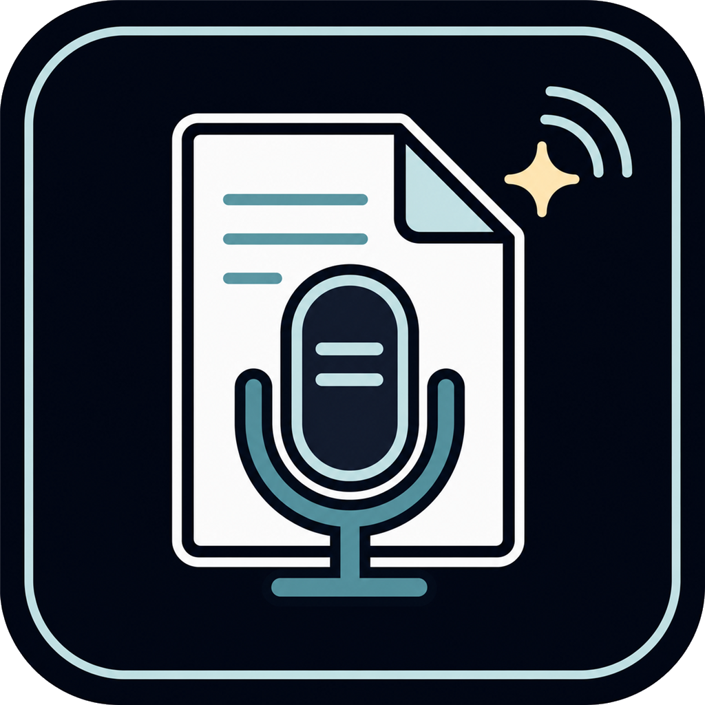
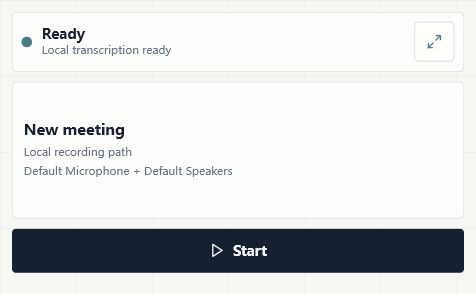

<p align="center">
  
</p>

# Note Taker

A local-first meeting recorder for Windows. It captures your microphone and system audio at the same time, transcribes on-device with whisper.cpp, and turns the transcript into structured meeting notes — summary, decisions, action items, open questions. Audio capture and local transcription stay on your machine by default; optional OpenAI transcription uploads audio windows, and Codex summaries send transcript text to Codex.

Built with Tauri 2 (Rust backend) and React.


<details>
<summary>More screenshots — Night Atlas theme, mini recorder, narrow layout</summary>





</details>

## Features

- **Dual-stream capture** — records the microphone and computer audio (WASAPI loopback) as separate concurrent streams, persisted in short chunks so a crash never loses more than a few seconds.
- **Smart transcription windows** — instead of feeding fixed slices to Whisper, the app detects utterances by silence analysis, merges them into ~16–30 s windows with pre/post-roll, normalizes volume, and skips silent stretches entirely. Faster and noticeably more accurate than naive chunking.
- **Local transcription by default** — a whisper.cpp sidecar (pinned release, SHA-256 verified on download) runs `large-v3-turbo` on your machine; switch to `large-v3` for maximum accuracy. The app guides you through downloading the runtime and model on first launch.
- **Custom glossary** — feed it your team's product names, acronyms, and jargon, and they get injected into the Whisper prompt so transcripts spell them correctly.
- **Structured summaries via Codex CLI** — transcripts are sent to Codex CLI and distilled into a suggested title, overview, topics, decisions, action items with owners, open questions, and an outline. Long-running transcribe/summarize tasks can be cancelled mid-flight.
- **Everything in SQLite** — meetings, chunks, transcript segments, summaries, and settings live in one local database, with search across titles, summaries, action items, and transcript text. Archive a meeting to hide it without deleting anything.
- **Chinese-friendly** — multilingual model by default, glossary prompting works in Chinese, and Traditional output is normalized to Simplified via OpenCC.
- **Optional OpenAI transcription** — opt in to `gpt-4o-transcribe`, `gpt-4o-mini-transcribe`, or `whisper-1`. Your API key is stored in Windows Credential Manager, never in the database, and any failed cloud window automatically falls back to local Whisper.
- **Quality-of-life** — mini always-on-top recorder window, two themes (Archive Sheet / Night Atlas), Markdown and JSON export, signed in-app auto-updates from GitHub Releases.

Not there yet: recording does not survive closing the window (no tray mode), and transcripts/summaries are read-only in the UI.

## Install

Download the latest MSI or NSIS installer from [Releases](https://github.com/yihuil1992/note-taker/releases). Installers are not code-signed yet, so expect a SmartScreen warning.

Summaries require [Codex CLI](https://github.com/openai/codex) on your PATH; recording and transcription work without it.

## Usage

1. On first launch, let the setup panel fetch the whisper.cpp runtime and model (~1.6 GB for the default model).
2. Hit record — you'll be asked to confirm meeting consent — and stop when the meeting ends.
3. Open the meeting and run **Transcribe**, then **Summarize**.
4. Search past meetings, export as Markdown/JSON, or archive what you no longer need.

To use OpenAI for transcription, select it in Settings and paste your API key. The app stores it in Windows Credential Manager. Developers can still launch the app with `OPENAI_API_KEY` for local testing or CI; that process environment variable takes precedence over the stored key.

## Privacy

- Audio and local Whisper transcripts stay on your machine by default.
- Selecting the OpenAI transcription provider uploads audio windows to OpenAI.
- Running Codex summaries sends transcript text to Codex CLI for structured summary generation; generated summaries are stored locally afterward.
- Raw audio is retained for 7 days by default, then cleaned up.
- Secrets go through the OS credential store, not SQLite.
- `OPENAI_API_KEY` is only a developer/CI override. If it is set in the app process environment, it overrides the key saved in Settings.

## Architecture

```
React UI (src/main.tsx)
        │  Tauri commands
        ▼
Rust core (src-tauri/src/)
  recording.rs      mic + loopback capture into chunked WAVs
  smart_chunks.rs   silence-aware window building + normalization
  sidecar.rs        whisper.cpp download, verify, run
  openai_*.rs       cloud transcription + credential storage
  summary.rs        Codex CLI structured summaries
  storage.rs        SQLite (meetings, segments, summaries, search)
  task_control.rs   cancellation for long-running jobs
```

Each pipeline stage is also exposed as a standalone Rust binary (`pnpm meeting:demo`, `meeting:transcribe`, `meeting:summarize`, `sidecar:runtime`, …) so you can exercise capture, windowing, transcription, and summarization from the terminal without launching the app.

## Development

Requires Node.js + pnpm, stable Rust, and the WebView2 runtime.

```powershell
pnpm install
pnpm tauri:dev      # desktop app
pnpm dev            # browser-only preview with mock data
pnpm tauri build    # installers → src-tauri/target/release/bundle/
```

Checks:

```powershell
pnpm typecheck
cargo test --manifest-path src-tauri/Cargo.toml
```

CI runs the frontend build and Rust tests on every push to `main`. Pushing a `v*` tag builds Windows artifacts and publishes a GitHub Release with the updater manifest (needs the `TAURI_SIGNING_PRIVATE_KEY` secret).
