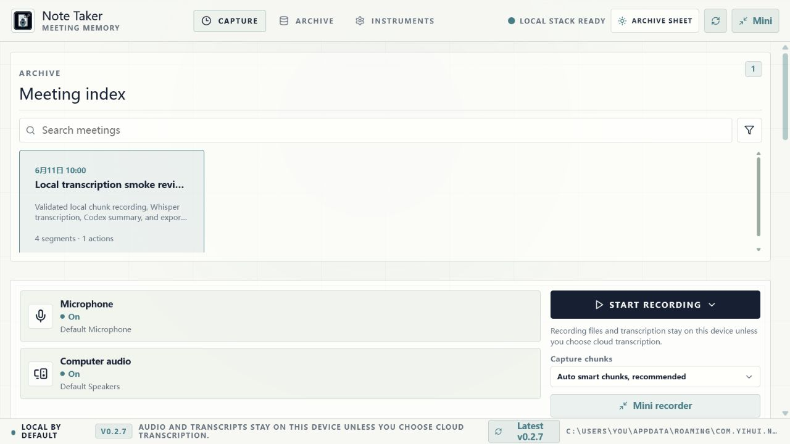
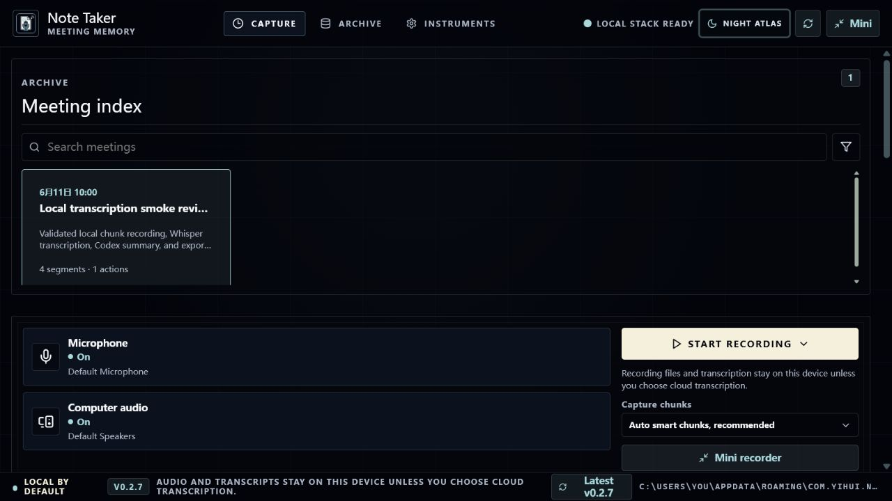
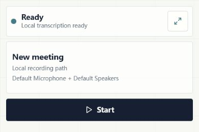
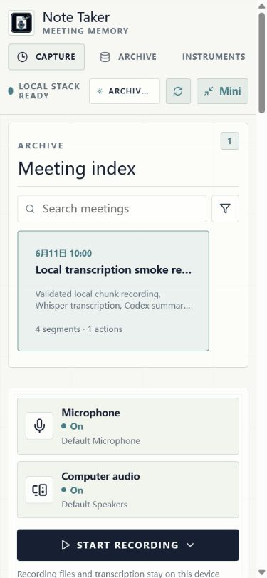

<p align="center">
  
</p>

# Note Taker

Note Taker is a local-first Windows meeting memory workspace. It records microphone and system audio as separate streams, turns speech into source-attributed transcript segments, and asks Codex to produce a structured meeting record with overview, topics, decisions, action items, open questions, and expandable detail.

The default path keeps recording and transcription local through a pinned whisper.cpp sidecar. Cloud transcription is optional: when you choose OpenAI, audio windows are uploaded for speech-to-text, the API key is stored in Windows Credential Manager, and failed cloud windows fall back to local Whisper.

Built with Tauri 2, Rust, React, TypeScript, SQLite, and a Windows-first audio pipeline.



<details>
<summary>More screenshots - Night Atlas theme, mini recorder, narrow layout</summary>







</details>

## What It Does

- **Dual-stream recording** - captures microphone and computer audio concurrently with WASAPI loopback, stores them as separate short WAV chunks, and keeps source labels for review.
- **Near-realtime recording flow** - the desktop app can start/stop a background recording session, keep a 4-hour failsafe, and wait for the current chunk to finish before closing the recording cleanly.
- **Smart transcription windows** - combines raw chunks into source-aware windows using lightweight silence analysis, pre/post-roll, and RMS normalization before ASR. Local Whisper uses shorter Me/Others windows; OpenAI uses longer windows with service-side chunking when supported.
- **Local Whisper setup** - downloads and verifies the pinned official whisper.cpp Windows runtime plus the multilingual `large-v3-turbo` model by default. `large-v3` remains available for maximum accuracy.
- **Optional OpenAI transcription** - supports `gpt-4o-transcribe`, `gpt-4o-mini-transcribe`, and `whisper-1`. Provider, model, language hint, and API key are controlled from Settings.
- **Codex summaries** - sends transcript text to Codex CLI for a structured meeting record. Per-run options can change model, summary language, reference depth, git-change inclusion, and selected reference projects.
- **Project-aware context** - lets you register local project folders as read-only candidate context. Codex decides what is relevant during summary generation; secrets, bulky files, build output, databases, logs, and images are filtered out.
- **Useful review workspace** - meeting history, full-text search, archive, transcript review, Markdown/JSON export, task progress, cancellation, completion notifications, and a compact always-on-top mini recorder.
- **Chinese-friendly defaults** - defaults to a Chinese language hint, adds language-specific prompts, normalizes Traditional Chinese transcript output to Simplified Chinese, and supports Chinese/Japanese/English summary output.
- **Signed in-app updates** - checks GitHub Releases for Tauri updater bundles and can download, install, and relaunch when a signed update is available.

Not there yet: recording does not survive closing the app window, there is no tray recorder, and transcripts/summaries are still read-only in the UI.

## Install

Download the latest MSI or NSIS installer from [Releases](https://github.com/yihuil1992/note-taker/releases). Installers are not Windows code-signed yet, so SmartScreen may warn on first install.

Summaries require [Codex CLI](https://github.com/openai/codex) on your PATH. Recording and transcription can run without Codex.

## Usage

1. Launch the app and complete Local Whisper setup, or switch the transcription provider to OpenAI in Settings.
2. Confirm meeting consent, then start recording. Note Taker records microphone and computer audio together.
3. Stop recording when the meeting ends. The app stores chunks locally and shows the meeting in the archive.
4. Run transcription, then generate or regenerate a Codex summary. Choose reference projects or summary options when needed.
5. Search past meetings, review transcript/source segments, export Markdown/JSON, or archive old meetings without deleting their stored data.

OpenAI transcription is opt-in. The Settings UI stores your API key in Windows Credential Manager under `com.yihui.notetaker.openai`. For developer runs, `OPENAI_API_KEY` in the app process environment takes precedence over the stored key.

## Privacy

- Audio and local Whisper transcripts stay on your machine by default.
- Selecting the OpenAI transcription provider uploads audio windows to OpenAI for transcription.
- Running Codex summaries sends transcript text, glossary hints, and selected reference context snippets to Codex CLI.
- Reference project folders are read-only inputs; the app filters common secret and bulky paths before summary context is built.
- Raw audio retention defaults to 7 days and is explicit in Settings.
- Provider secrets go through the OS credential store, not SQLite.

## Architecture

```text
React UI (src/main.tsx)
        | Tauri commands
        v
Rust core (src-tauri/src/)
  recording.rs             managed background recording sessions
  audio.rs                 microphone + WASAPI loopback capture
  meeting.rs               chunk queue, provider dispatch, fallback
  smart_chunks.rs          source-aware transcription windows
  sidecar.rs               whisper.cpp runtime/model setup
  openai_transcription.rs  OpenAI speech-to-text upload path
  openai_credentials.rs    Windows Credential Manager API key storage
  summary.rs               Codex summary prompts + reference context
  storage.rs               SQLite, settings, search, archive
  exports.rs               Markdown and JSON export
  task_control.rs          progress polling and cancellation
  updates.rs               GitHub/Tauri updater checks
```

The pipeline stages are also exposed as standalone Rust binaries so capture, transcription, sidecar setup, and summaries can be exercised from the terminal without launching the desktop app.

## Development

Requires Node.js, pnpm, stable Rust, and WebView2.

```powershell
pnpm install
pnpm dev                    # browser preview with mock data
pnpm tauri:dev              # desktop app
pnpm tauri:build:exe        # fast release exe refresh
pnpm tauri:build:installer  # full Windows installer/updater artifacts
```

Useful checks:

```powershell
pnpm typecheck
pnpm build
cargo check --manifest-path src-tauri/Cargo.toml
cargo test --manifest-path src-tauri/Cargo.toml
```

Local pipeline helpers:

```powershell
pnpm audio:spike 3
pnpm meeting:demo 6 3 target\meeting-demo
pnpm meeting:transcribe <meeting-id> target\meeting-demo
pnpm meeting:summarize <meeting-id> target\meeting-demo
pnpm sidecar:runtime target\sidecar-runtime
pnpm sidecar:model target\meeting-demo
pnpm transcribe:smoke <input-wav> [app-data-dir]
```

CI runs the frontend typecheck/build and Rust checks on Windows. The release workflow builds unsigned Windows installers plus signed Tauri updater bundles; publishing a `v*` tag creates or updates the GitHub Release and `latest.json` updater manifest.
